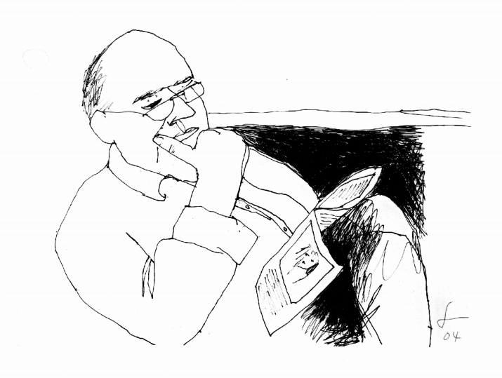

# [tony-dingman.github.io]( https://tony-dingman.github.io/ )

a home page for the works of Tony Dingman

## [The Night Before Thinking]( tony-ding-the-night-before-thinking.pdf )

* A book of poems published in 2014, introduction by Jack Hirschman

## [The Book of No]( tony-ding-the-book-of-no.pdf )

* 'Nothing to Report' and other no-sense efforts

## [Three for the Seesaw]( tony-ding-three-for-the-seesaw.pdf )

* A one and only three page book

## [Mad Scheme of the Day]( tony-ding-mad-scheme-of-the-day.pdf )

* With Theo at Zeotrope. 27 May 2017

***

### Links of Interest

* PDFs on GitHub: <https://github.com/tony-dingman/tony-dingman.github.io>
* <https://openspace.sfmoma.org/2013/01/receipt-of-delivery29/>
* <http://bancroft.berkeley.edu/collections/Shig_Murao/SR_4.html>
* <https://jackmicheline.outlawpoetry.com/2010/09/09/poem-from-a-letter-to-tony-dingman-october-19-1990/>
* <https://terryvanzandt.wordpress.com/tag/tony-dingman/>
* <http://www.independent.co.uk/arts-entertainment/caged-heat-1323910.html>
* <https://www.bonappetit.com/restaurants-travel/article/best-last-dive-bar-in-world>
* <https://www.pressreader.com/usa/san-francisco-chronicle/20160501/284386968471661>
* <http://www.imdb.com/name/nm0227666/?ref_=nmbio_bio_nm>
* <http://www.imdb.com/name/nm0227666/bio?ref_=nm_ov_bio_sm>

### Copyright and License

Copyright &copy; 2017 Tony Dingman

 This work is licensed under a <a rel="license" href="http://creativecommons.org/licenses/by-nc-sa/4.0/">Creative Commons Attribution-NonCommercial-ShareAlike 4.0 International License</a>.
